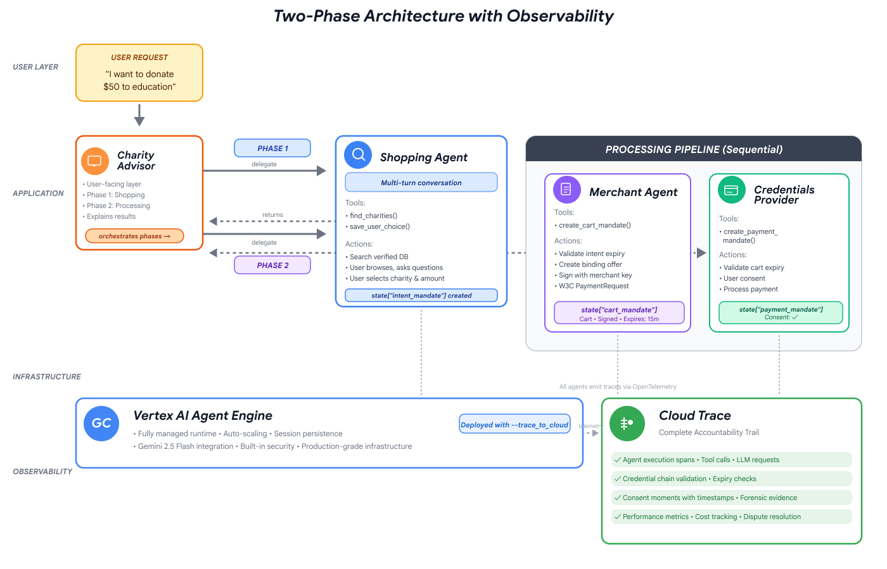

# 🎗️ Building Trustworthy Charity Agents with Google ADK and AP2


A hands-on codelab teaching you to build production-grade AI agents that handle financial transactions with complete transparency, verifiable credentials, and forensic accountability using Google's Agent Development Kit (ADK) and the Agent Payments Protocol (AP2).


## 🌟 What You'll Build

A complete AI donation system that:

- ✅ Finds verified charities from a trusted database
- ✅ Creates binding offers with W3C PaymentRequest standards
- ✅ Processes payments with explicit user consent
- ✅ Maintains complete audit trails via Cloud Trace
- ✅ Enforces role separation and credential validation
- ✅ Provides forensic evidence for dispute resolution

### The Problem

Individual giving totals **$374 billion annually** in the US, yet billions in intended donations never reach charities due to research friction, trust verification challenges, and analysis paralysis. Your trustworthy agent solves this by combining **speed** with **accountability**.

## 🏛️ Architecture

Multi-agent system with specialized roles and credential-based trust boundaries:



### Core Principles

**Role-Based Separation** (AP2)
- Each agent has one job, sees only what it needs
- Shopping: Cannot process payments
- Merchant: Cannot access credentials  
- Credentials: Cannot modify cart

**Verifiable Credentials** (AP2)
- **IntentMandate**: User's selection with 1-hour expiry
- **CartMandate**: Merchant's signed offer with 15-minute expiry
- **PaymentMandate**: User consent with timestamp proof

**Sequential Orchestration** (ADK)
- SequentialAgent enforces correct order
- Validation callbacks check prerequisites
- State-based handoffs maintain boundaries

## 📋 Prerequisites

- Python 3.10+
- Google Cloud Project with billing
- `gcloud` CLI authenticated
- Git and basic Python knowledge

## 🚀 Quick Start

```bash
# Clone repository
git clone https://github.com/ayoisio/adk-ap2-charity-agents.git
cd adk-ap2-charity-agents
git checkout codelab  # Placeholder version for learning

# Setup environment
python3 -m venv venv
source venv/bin/activate
pip install -r charity_advisor/requirements.txt
pip install -e .

# Configure Google Cloud
gcloud config set project YOUR_PROJECT_ID
gcloud services enable aiplatform.googleapis.com secretmanager.googleapis.com cloudtrace.googleapis.com

# Create .env file
cp .env.template .env
sed -i "s/your-project-id/$(gcloud config get-value project)/g" .env

# Verify setup
python scripts/verify_setup.py
```

Expected output:
```
✓ Python version: 3.11.x
✓ google-adk: 1.17.0
✓ All directories present
✓ Setup complete! You are ready to build trustworthy agents.
```

## 📖 Follow the Codelab

**👉 [Start the Codelab](https://codelabs.developers.google.com/adk-ap2-charity-agents/instructions)**

The codelab guides you through 10 modules (2 hours total):

1. **Understanding the Problem** - Why trust matters for AI agents
2. **Setup** - Environment configuration
3. **First Agent** - Discover the trust gap
4. **Shopping Agent** - Build IntentMandate credential
5. **Merchant Agent** - Create CartMandate with signatures
6. **Credentials Provider** - Process PaymentMandate with consent
7. **Orchestration** - Wire agents with SequentialAgent
8. **Deployment** - Deploy to Agent Engine or Cloud Run
9. **Observability** - Read Cloud Trace as forensic evidence
10. **Production Path** - Understand production requirements

Each module includes:
- Clear learning objectives
- Step-by-step code completion
- Verification scripts
- Conceptual explanations

## 🏗️ Project Structure

```
adk-ap2-charity-agents/
├── charity_advisor/
│   ├── agent.py                      # Root orchestration + pipelines
│   ├── agent_engine_app.py           # Deployment wrapper
│   ├── simple_agent/agent.py         # Module 3: Trust gap discovery
│   ├── shopping_agent/agent.py       # Module 4: IntentMandate
│   ├── merchant_agent/agent.py       # Module 5: CartMandate
│   ├── credentials_provider/agent.py # Module 6: PaymentMandate
│   ├── tools/                        # All tool implementations
│   └── data/charities.py             # Mock charity database
├── scripts/                          # Verification and testing
├── img/                              # Codelab diagrams
├── deploy.sh                         # Unified deployment
├── instructions.md                   # Complete codelab content
└── README.md                         # This file
```

## 🚢 Deployment Options

| | Local | Agent Engine | Cloud Run |
|---|-------|--------------|-----------|
| **Command** | `./deploy.sh local` | `./deploy.sh agent-engine` | `./deploy.sh cloud-run` |
| **Sessions** | In-memory | Managed | Cloud SQL |
| **Scaling** | Single | Automatic | Serverless |
| **UI** | ✅ Built-in | ❌ API only | ✅ Optional |
| **Best For** | Development | Production | Production + UI |

**Recommended**: Use Agent Engine for production deployments.

## 🧪 Testing

```bash
# Verify each module as you complete it
python scripts/test_merchant.py              # Module 5
python scripts/test_credentials_provider.py  # Module 6
python scripts/test_full_pipeline.py         # Module 7
python scripts/test_deployed_agent.py        # Module 8

# Interactive testing
adk web  # Module 7+
```

## 📊 Observability

Every donation generates a Cloud Trace showing:

```
CharityAdvisor.run (8.2s)
  └─ ShoppingAgent (2.1s) → IntentMandate created
  └─ DonationPipeline (6.1s)
      ├─ MerchantAgent (1.8s) → CartMandate created  
      └─ CredentialsProvider (4.0s) → PaymentMandate + consent (29s wait)
```

**View traces**: [Cloud Trace Explorer](https://console.cloud.google.com/traces/list)

## 🔒 Security

⚠️ **Safe Learning Environment**: All data is simulated. No real payments, charities, or financial information.

**Production Upgrades Required**:

| Workshop | Production |
|----------|-----------|
| SHA-256 signatures | PKI/JWT signatures |
| Simulated payments | Stripe/PayPal APIs |
| Mock database | IRS/Charity Navigator APIs |
| No auth | OAuth 2.0/WebAuthn |
| `.env` secrets | Secret Manager/KMS |

**Architecture is production-ready. Implementations need upgrading.**

## 🎓 What You'll Learn

**ADK Concepts**: Agent class, FunctionTool, SequentialAgent, state management, validation callbacks  
**AP2 Concepts**: Role separation, verifiable credentials, expiry validation, explicit consent  
**Production Patterns**: Trust boundaries, defensive programming, observability, human-in-the-loop

## 📚 Resources

- [ADK Documentation](https://google.github.io/adk-docs/)
- [AP2 Protocol Specification](https://ap2-protocol.org)
- [Agent Engine Guide](https://cloud.google.com/vertex-ai/generative-ai/docs/agent-engine/overview)
- [Cloud Trace Documentation](https://cloud.google.com/trace/docs)
- [W3C PaymentRequest API](https://www.w3.org/TR/payment-request/)

---

**Ready to Build?** 👉 [Start the Codelab](https://codelabs.developers.google.com/adk-ap2-charity-agents/instructions) ❤️